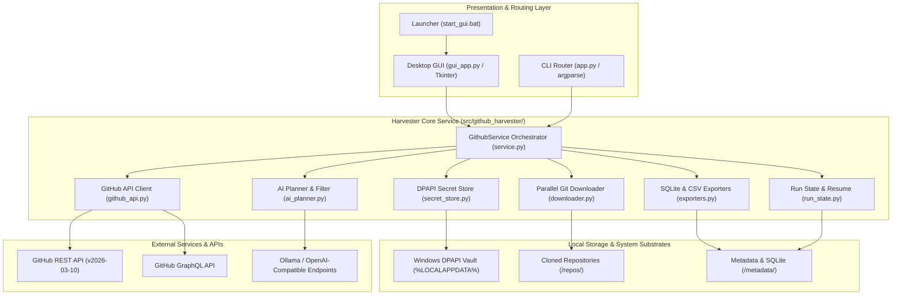

# GitHub Search Downloader

**English** | [Русский](./README.ru.md)

<!-- tdm-reservation: 1 -->
[](https://www.python.org/downloads/)
[](https://www.microsoft.com/windows)
[](SECURITY.md)
[](LICENSE.txt)
[-orange.svg)](.well-known/tdmrep.json)
[](#)
[](SECURITY.md)

High-performance Windows desktop application (GUI + CLI) designed for mass GitHub repository discovery, date-sharded harvesting, AI-assisted relevance evaluation, and multi-format metadata analytics.

> [!IMPORTANT]
> **Core Architectural Value:** Overcomes the standard 1,000-result search barrier of the GitHub REST API by implementing autonomous recursive date-range bisection sharding while respecting GitHub secondary rate-limit envelopes.

---

## Overview

GitHub Search Downloader provides an enterprise-grade ingestion pipeline for researchers, data scientists, and OSINT analysts requiring comprehensive code collection across broad temporal boundaries.

### Key Capabilities
- **Uncapped Discovery:** Automatically shards multi-year queries into recursive date intervals (`created:YYYY-MM-DD..YYYY-MM-DD`) when result counts exceed 1,000.
- **Resilient Git Engine:** Parallelized cloning with shallow (`--depth 1`), partial (`--filter=blob:none`), single-branch, and no-tags profiles backed by Windows process-tree timeouts (`taskkill /T /F`).
- **Two-Phase AI Selection:** Natural-language query translation and semantic shortlist evaluation via local Ollama instances or any OpenAI-compatible API gateway (OpenRouter, LM Studio, vLLM).
- **Deep Relevance Ranking:** Evaluates in-memory README content and Git tree structure for candidate shortlists without storing unwanted file contents.
- **Relational & Tabular Export:** Real-time metadata serialization to SQLite (`executemany` batch transactions) and CSV formats.
- **Zero-Plaintext Security:** Encrypts personal access tokens and cloud AI keys using native Windows DPAPI in `%LOCALAPPDATA%\GithubSearchDownloader\secrets`.

---

## System Architecture

The following C4 Container model details the runtime topology and isolation boundaries:

<details>
<summary><b>View System Architecture Diagram (Mermaid C4)</b></summary>





</details>

---

## Quickstart

### GUI Launcher
The easiest way to start on Windows is via the pre-configured batch launcher:

```powershell
cd M:\Projects\Programs\GithubSearch
start_gui.bat
```

1. Enter your search topic or natural language task.
2. Select an AI Provider (optional) to auto-configure query parameters.
3. Click **Start** to begin harvesting.

### CLI Discovery & Dry-Run
Run non-destructive search and metadata indexing without cloning repositories:

```powershell
cd M:\Projects\Programs\GithubSearch
python app.py --query "osint security tools" --output ".\output\osint_run" --dry-run --max-repos 20 --export-sqlite "metadata\repos.sqlite"
```

---

## Production Workflows

### Full Dataset Harvester
Execute an unconstrained full-depth harvest with keyword pre-filtering:

```powershell
python app.py --query "neural network visualizer" --output "M:\Datasets\GitHubAI" --include-keywords "pytorch,tensorflow" --exclude-keywords "tutorial,homework" --batch-size 50 --workers 4
```

### Incremental Update
Update an existing repository directory without re-downloading previously processed repositories:

```powershell
python app.py --query "autonomous agents" --output "M:\Datasets\Agents" --incremental --max-repos 500
```

### SQLite & CSV Export
Export structured repository analytics into a queryable local database:

```powershell
python app.py --query "security scanners" --output ".\output\scanners" --dry-run --export-sqlite "metadata\scanners.sqlite" --export-csv
```

### Deep Relevance & GraphQL Enrichment
Fetch repository releases, default branch commit OIDs, and score README/tree relevance:

```powershell
python app.py --query "kubernetes operators" --output ".\output\k8s" --dry-run --graphql-enrich --deep-relevance --deep-relevance-max-repos 30 --export-sqlite "metadata\k8s.sqlite"
```

---

## AI Integration

### Local AI via Ollama
Ensure Ollama is running locally (`ollama serve`), then configure via CLI or GUI:

```powershell
python app.py --query "ai code review" --output ".\output\codereview" --ai-filter --ai-provider ollama --ai-filter-endpoint "http://127.0.0.1:11434" --ai-filter-model "llama3.2:latest"
```

### OpenAI-Compatible Cloud Endpoints
Save your API key securely into Windows DPAPI before running:

```powershell
# Store API Key in DPAPI encrypted store
python app.py --ai-provider openai-compatible --ai-filter-endpoint "https://openrouter.ai/api/v1" --save-ai-api-key

# Execute harvest with cloud-assisted selection
python app.py --query "malware analysis" --output ".\output\malware" --ai-filter --ai-provider openai-compatible --ai-filter-endpoint "https://openrouter.ai/api/v1" --ai-filter-model "openrouter/free"
```

---

## Security & Credential Protection

### DPAPI Storage Mechanics
Tokens and API keys are protected using the Windows Data Protection API (`CryptProtectData`). Secrets are never written to `gui_settings.json` or visible in CLI history.

```powershell
# Save GitHub Personal Access Token into protected user storage
python app.py --save-github-token

# Check credential enrollment status
python app.py --show-token-status

# Delete credential from local vault
python app.py --delete-saved-github-token
```

### Modern Token Compatibility
The cryptographic buffer and memory subsystems support variable-length token formats up to **520+ characters** (`ghs_APPID_JWT`), ensuring full compatibility with modern GitHub App authentication.

---

## Windows Packaging & Release Integrity

### Building Standalone Executable
Build a single-file Windows executable via PyInstaller:

```powershell
# Ensure build dependencies are installed
python -m pip install .[build]

# Run Windows build script
.\build_windows.ps1
```

### Verifying Release Packages
Verify release zip package checksums, manifests, and Authenticode signatures:

```powershell
.\verify_release_windows.ps1 -Version "1.0.0"
```

---

## Documentation Dispatcher

| Document | Purpose |
| :--- | :--- |
| [`docs/ARCHITECTURE.md`](docs/ARCHITECTURE.md) | Component architecture, process concurrency, and data flow specifications. |
| [`docs/decisions/`](docs/decisions/) | Architecture Decision Records (ADRs) in MADR 4.0.0 format. |
| [`docs/PROJECT_HISTORY.md`](docs/PROJECT_HISTORY.md) | Chronological development log, releases, and feature milestones. |
| [`SECURITY.md`](SECURITY.md) | Vulnerability disclosure, DPAPI encryption architecture, and threat model. |
| [`CONTRIBUTING.md`](CONTRIBUTING.md) | Development setup, Decision Shadow Commit standards, and Contributor Agreement. |
| [`CODE_OF_CONDUCT.md`](CODE_OF_CONDUCT.md) | Community pledge, behavioral standards, and enforcement policies. |
| [`llms.txt`](llms.txt) | Machine-readable context specification for autonomous AI agents (TOON format). |

---

## Contributing & Support

- **Code of Conduct:** Read our community pledge and behavioral standards in [CODE_OF_CONDUCT.md](CODE_OF_CONDUCT.md).
- **Issue Tracker:** Report reproducible defects via [.github/ISSUE_TEMPLATE/bug_report.yml](.github/ISSUE_TEMPLATE/bug_report.yml).
- **Feature Proposals:** Suggest enhancements via [.github/ISSUE_TEMPLATE/feature_request.yml](.github/ISSUE_TEMPLATE/feature_request.yml).
- **Discussions & Support:** Consult [.github/SUPPORT.md](.github/SUPPORT.md) for community links and Q&A.

---

## License & Legal Notices

Copyright &copy; 2026 Nikita Kizevich. All rights reserved.

This software and its documentation are proprietary. No permission is granted to copy, modify, distribute, sublicense, or use this software except under a separate written agreement with the copyright holder. See [LICENSE.txt](LICENSE.txt) for details.

<!-- W3C Text and Data Mining Reservation -->
Text and Data Mining (TDM) rights are explicitly reserved under Article 53 of the EU AI Act and Directive (EU) 2019/790 Article 4(3). Automated scraping for AI training is strictly prohibited. See [`.well-known/tdmrep.json`](.well-known/tdmrep.json).
