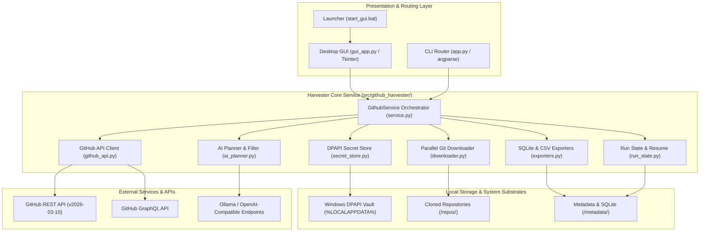

# GitHub Search Downloader

[English](./README.md) | **Русский**

<!-- tdm-reservation: 1 -->
[](https://www.python.org/downloads/)
[](https://www.microsoft.com/windows)
[](SECURITY.md)
[](LICENSE.txt)
[-orange.svg)](.well-known/tdmrep.json)
[](#)
[](SECURITY.md)

Высокопроизводительное десктопное приложение для Windows (GUI + CLI), спроектированное для массового поиска GitHub-репозиториев, шардированного выгруза по датам, ИИ-оценки релевантности и экспорта метаданных в аналитические форматы.

> [!IMPORTANT]
> **Ключевая архитектурная ценность:** Преодолевает стандартный лимит GitHub REST API в 1 000 результатов за счет рекурсивного шардирования временных диапазонов (bisection sharding), с жестким контролем secondary rate-limit лимитов GitHub.

---

## Обзор

GitHub Search Downloader предоставляет масштабируемый пайплайн сбора данных для исследователей, аналитиков OSINT и специалистов по ИИ, которым требуется полный сбор репозиториев за широкие исторические периоды.

### Ключевые возможности
- **Полнота без ограничений:** Автоматическое разбиение поисковых запросов на рекурсивные интервалы (`created:YYYY-MM-DD..YYYY-MM-DD`), если число результатов превышает 1 000.
- **Отказоустойчивый Git-движок:** Параллельное клонирование с поддержкой легковесных профилей (`--depth 1`, `--filter=blob:none`, single-branch, no-tags) и принудительным завершением зависших деревьев процессов (`taskkill /T /F`).
- **Двухфазный ИИ-отбор:** Трансляция задач на естественном языке и семантический отбор кандидатов через локальный Ollama или облачные OpenAI-совместимые шлюзы (OpenRouter, LM Studio, vLLM).
- **Оценка глубокой релевантности:** Анализ README и структуры Git-дерева в оперативной памяти без засорения диска содержимым нерелевантных файлов.
- **Реляционный и табличный экспорт:** Потоковая выгрузка метаданных в SQLite (пакетные транзакции `executemany`) и CSV-файлы.
- **Защита без открытого текста:** Шифрование токенов доступа и API-ключей через Windows DPAPI в каталоге `%LOCALAPPDATA%\GithubSearchDownloader\secrets`.

---

## Архитектура системы

Модель контейнеров C4 детально описывает топологию исполнения и границы изоляции компонентов:

<details>
<summary><b>Показать диаграмму архитектуры (Mermaid C4)</b></summary>





</details>

---

## Быстрый старт

### Запуск через GUI
Самый удобный способ запуска в Windows — использование готового командного файла:

```powershell
cd M:\Projects\Programs\GithubSearch
start_gui.bat
```

1. Введите тему поиска или задачу на естественном языке.
2. При необходимости выберите ИИ-провайдера для автонастройки параметров.
3. Нажмите **Запуск** для старта сбора.

### Запуск через CLI (Dry-Run)
Поиск и индексация метаданных без фактического скачивания исходного кода репозиториев:

```powershell
cd M:\Projects\Programs\GithubSearch
python app.py --query "osint security tools" --output ".\output\osint_run" --dry-run --max-repos 20 --export-sqlite "metadata\repos.sqlite"
```

---

## Рабочие сценарии (Production)

### Полный выгруз датасета
Массовый выгруз с предварительной фильтрацией по ключевым словам:

```powershell
python app.py --query "neural network visualizer" --output "M:\Datasets\GitHubAI" --include-keywords "pytorch,tensorflow" --exclude-keywords "tutorial,homework" --batch-size 50 --workers 4
```

### Инкрементальное обновление
Дополнение каталога новыми репозиториями без повторного скачивания уже существующих:

```powershell
python app.py --query "autonomous agents" --output "M:\Datasets\Agents" --incremental --max-repos 500
```

### Экспорт в SQLite и CSV
Выгрузка метаданных в структурированную локальную базу данных и CSV:

```powershell
python app.py --query "security scanners" --output ".\output\scanners" --dry-run --export-sqlite "metadata\scanners.sqlite" --export-csv
```

### Глубокая релевантность и обогащение через GraphQL
Получение релизов, OID коммитов и оценка релевантности через README и дерево файлов:

```powershell
python app.py --query "kubernetes operators" --output ".\output\k8s" --dry-run --graphql-enrich --deep-relevance --deep-relevance-max-repos 30 --export-sqlite "metadata\k8s.sqlite"
```

---

## Интеграция с ИИ

### Локальный ИИ через Ollama
Убедитесь, что Ollama запущена (`ollama serve`), затем запустите поиск:

```powershell
python app.py --query "ai code review" --output ".\output\codereview" --ai-filter --ai-provider ollama --ai-filter-endpoint "http://127.0.0.1:11434" --ai-filter-model "llama3.2:latest"
```

### Облачные OpenAI-совместимые шлюзы
Сохраните API-ключ в защищенное хранилище Windows DPAPI перед запуском:

```powershell
# Сохранение API-ключа в зашифрованное хранилище DPAPI
python app.py --ai-provider openai-compatible --ai-filter-endpoint "https://openrouter.ai/api/v1" --save-ai-api-key

# Запуск выгруза с отбором через облачную модель
python app.py --query "malware analysis" --output ".\output\malware" --ai-filter --ai-provider openai-compatible --ai-filter-endpoint "https://openrouter.ai/api/v1" --ai-filter-model "openrouter/free"
```

---

## Безопасность и защита учетных данных

### Механизм хранения через Windows DPAPI
Токены и ключи API шифруются через Windows Data Protection API (`CryptProtectData`). Секреты никогда не записываются в `gui_settings.json` и не сохраняются в истории CLI.

```powershell
# Сохранить персональный токен GitHub в защищенное хранилище
python app.py --save-github-token

# Проверить статус сохраненного токена
python app.py --show-token-status

# Удалить токен из локального хранилища
python app.py --delete-saved-github-token
```

### Совместимость с современными токенами
Буферы памяти и криптографическая подсистема поддерживают токены переменной длины до **520+ символов** (`ghs_APPID_JWT`), обеспечивая совместимость с GitHub App.

---

## Сборка и целостность релизов Windows

### Сборка исполняемого файла .exe
Создание автономного Windows-бинарника с помощью PyInstaller:

```powershell
# Установка сборочных зависимостей
python -m pip install .[build]

# Запуск скрипта сборки
.\build_windows.ps1
```

### Верификация релизных пакетов
Проверка контрольных сумм SHA-256, манифестов и подписей Authenticode:

```powershell
.\verify_release_windows.ps1 -Version "1.0.0"
```

---

## Навигатор по документации

| Документ | Назначение |
| :--- | :--- |
| [`docs/ARCHITECTURE.md`](docs/ARCHITECTURE.md) | Архитектура компонентов, многопоточность и схема потоков данных. |
| [`docs/decisions/`](docs/decisions/) | Журнал архитектурных решений (ADR) в стандарте MADR 4.0.0. |
| [`docs/PROJECT_HISTORY.md`](docs/PROJECT_HISTORY.md) | Хронологический журнал изменений, релизы и история фич. |
| [`SECURITY.md`](SECURITY.md) | Политика безопасности, модель угроз и шифрование DPAPI. |
| [`CONTRIBUTING.md`](CONTRIBUTING.md) | Настройка окружения, Decision Shadow коммиты и соглашение CLA. |
| [`CODE_OF_CONDUCT.md`](CODE_OF_CONDUCT.md) | Кодекс поведения сообщества, стандарты взаимодействия и модерация. |
| [`llms.txt`](llms.txt) | Машиночитаемая спецификация контекста для ИИ-агентов (формат TOON). |

---

## Участие в разработке и поддержка

- **Кодекс поведения:** Ознакомьтесь со стандартами взаимодействия сообщества в [CODE_OF_CONDUCT.md](CODE_OF_CONDUCT.md).
- **Отчеты об ошибках:** Сообщайте о багах через [.github/ISSUE_TEMPLATE/bug_report.yml](.github/ISSUE_TEMPLATE/bug_report.yml).
- **Предложения по развитию:** Описывайте новые идеи через [.github/ISSUE_TEMPLATE/feature_request.yml](.github/ISSUE_TEMPLATE/feature_request.yml).
- **Обсуждения и вопросы:** Обратитесь к [.github/SUPPORT.md](.github/SUPPORT.md) для получения ссылок на сообщество.

---

## Лицензия и правовая информация

Авторские права &copy; 2026 Никита Кизевич. Все права защищены.

Данное программное обеспечение и документация являются проприетарными. Копирование, модификация, распространение и использование разрешены только на основании отдельного письменного соглашения с правообладателем. Подробности в файле [LICENSE.txt](LICENSE.txt).

<!-- W3C Text and Data Mining Reservation -->
Права на интеллектуальный анализ текстов и данных (TDM) явно зарезервированы в соответствии со статьей 53 Закона ЕС об ИИ и статьей 4(3) Директивы (ЕС) 2019/790. Автоматический сбор для обучения ИИ-моделей запрещен. Подробности в файле [`.well-known/tdmrep.json`](.well-known/tdmrep.json).
