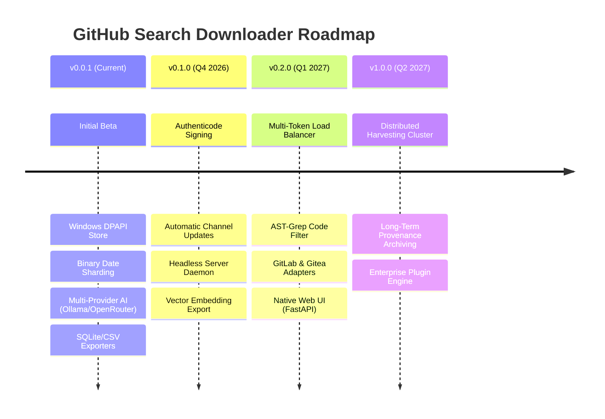

# Development Roadmap & Release Milestones

This document outlines the strategic engineering roadmap and planned capabilities for **GitHub Search Downloader**.

---

## 🎯 Release Milestone Overview

---

## Milestone Details

### v0.0.1 — Foundation & Core Harvester (Current)
- [x] Autonomous recursive date bisection sharding to bypass GitHub's 1,000 search limit.
- [x] Windows DPAPI hardware-bound secret encryption (`%LOCALAPPDATA%\GithubSearchDownloader\secrets`).
- [x] Multi-threaded shallow & blobless Git cloning (`--depth 1 --filter=blob:none`).
- [x] Two-phase AI relevance review pool (Auto-Keep, Auto-Drop, LLM Review, Exploration).
- [x] Native Windows GUI (`sv_ttk`) and scriptable CLI (`app.py`).
- [x] SQLite WAL-mode, CSV, and Repomix AI XML export capabilities.

### v0.1.0 — Supply Chain Security & Vector Exports (Target: Q4 2026)
- [ ] **Production Code Signing:** Integrate Azure Trusted Signing / Hardware Security Module (HSM) Authenticode certificate into `release_windows.ps1`.
- [ ] **Hosted Auto-Update Channel:** Direct update delivery via CDN-hosted `update_manifest.json` and in-app self-updating installer.
- [ ] **Vector Embedding Export:** Export cloned repository code snippets directly into Chroma / SQLite-vec with local embedding models (BGE / nomic-embed-text).
- [ ] **Supply Chain SBOM:** Generate CycloneDX and SPDX Software Bill of Materials during automated release workflows.

### v0.2.0 — Scaling & Multi-Platform Extensibility (Target: Q1 2027)
- [ ] **Multi-Token Quota Balancer:** Intelligent round-robin token rotation across multiple GitHub PATs with individual rate-limit tracking.
- [ ] **AST-Grep Filter Integration:** Structural AST matching (Python, TypeScript, Go, Rust) before cloning complete repositories.
- [ ] **Self-Hosted Forges:** Connectors for GitLab, Gitea, and Forgejo instances.
- [ ] **Headless REST / WebSocket Daemon:** Background daemon mode for remote orchestration and scheduled harvests.

### v1.0.0 — Enterprise Discovery Platform (Target: Q2 2027)
- [ ] **Distributed Multi-Worker Cluster:** Master-Worker architecture for large-scale enterprise OSINT and AI dataset construction.
- [ ] **SLSA Level 3 Provenance Attestation:** Cryptographically verifiable build provenance for all binary distributions.
- [ ] **Extensible Plugin Ecosystem:** Python-based plugin API for custom parsers, filters, and downstream analytics sinks.

---
*Architected & Packaged by [AI_Nikitka](https://t.me/Ai_nikitka93)*
